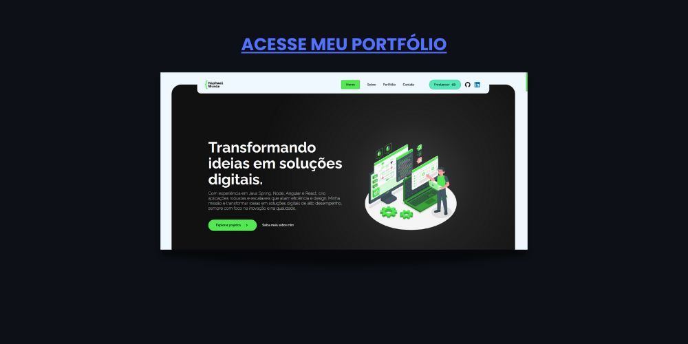

## Olá! Me chamo Raphael Muniz, seja bem-vindo(a) ao meu GitHub 😃

### 🌟 Sobre
#### &emsp;Sou desenvolvedor full stack (Spring e Angular), com proficiência no backend, estou me especializando em desenvolvimento de sistemas complexos, que demandam conhecimento em técnicas específicas para a resolução de desafios. Sou estudante de Sistemas de Informação na Universidade Federal de Uberlândia, atualmente estou no 4° período.

##

	
<h3>📖 <b>História</b></h3>

	
&emsp;Entrei no mundo da programação em 2020 (na época tinha 16 anos de idade), quando iniciei o ensino médio com técnico em informática integrado, até então não conhecia absolutamente nada de programação, no entanto, sempre tive o desejo de trabalhar em algum ramo da engenharia, devido a minha facilidade e admiração em desenvolver soluções, dessa maneira, ao decorrer do tempo, com os meus primeiros contatos com essa área de sistemas de informação, originou-se uma admiração muito grande pela área, e então, também começei a estudar por conta própria já que apenas o conhecimento adquirido no ambito academico não era suficiente para desenvolver os projetos que eu desejava, dessa maneira fui adquirindo conhecimento de forma constante, aprimorando paralelamente minhas habilidades de estudo autodidata. 
	 
	&emsp;Durante os 4 anos de ensino médio migrei para diversas áreas do mundo da TI, entre elas: frontend, backend, robótica (hardware e software), banco de dados, gestão, etc. no entanto, como é essencial escolher um nicho para focar e se desenvolver profissionalmente, decidi escolher a carreira fullstack, pois comtempla uma pilha mais abrangente de tecnlogias, e me permite desenvolver projetos mais complexos (meus favoritos), e me encaminha melhor para o meu maior objetivo na área, que é me tornar um Engenheiro de Software. Hoje possuo um planejamento de estudos, o qual sigo progredindo todos os dias, enfim, resumidamente essa é a minha história no mundo da tecnologia da informação.

##

### 👨🏻‍💻 Stack
> 

> 	🎨 Frontend
>	

>		
>  		
>  		
>	

> 	 
> 	💻 Backend
>	

>  		
>		
>		
>		
> 	

> 	 
>	🎲 Banco de dados
>  	

>  		
>  		
>  		
>  		
> 	
 
>	 
>	☁️ Nuvem
>  	

>  		
> 	
 
>	 
>	📦 Conteinerização 
>  	

>  		
> 	
 

  
  ##
### 🔗 Links

 
	
	
	 

##

<section>
 	<h3>📊 <b>Análise</b></h3>
	

		
		
	

	 
	

		
	

</section>

##

<section>
	<h3>📌 <b>Principais Repositórios</b></h3>
	

		
		
	

	

		
		
	

</section>

##

<section>
	<h3>🚀 <b>Portfólio</b></h3>
	

		
	

</section>
