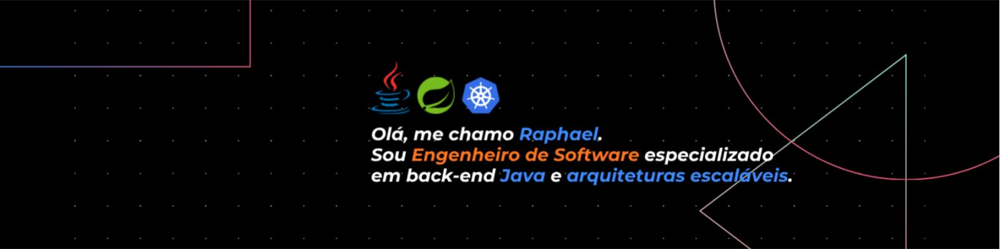
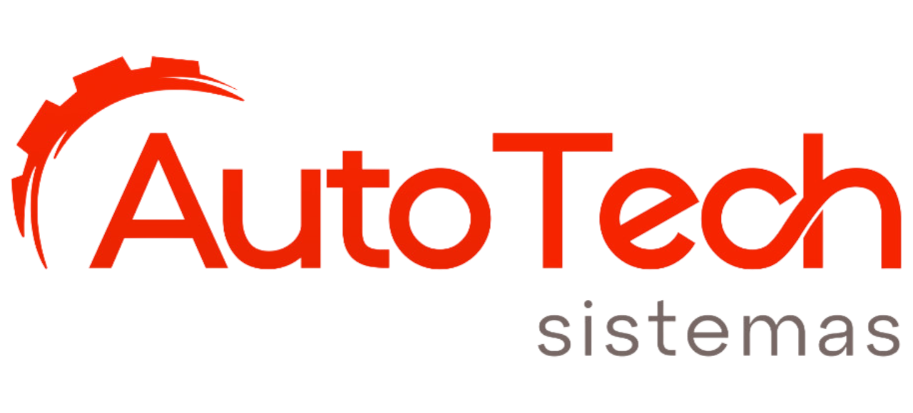
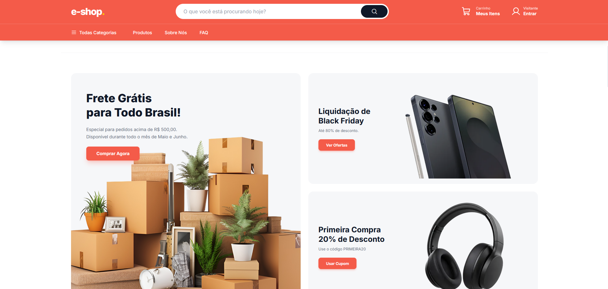
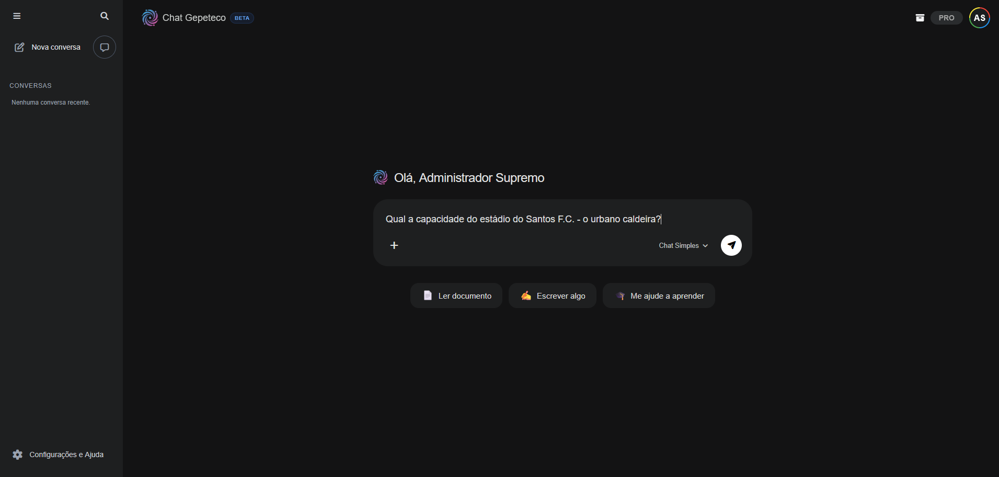
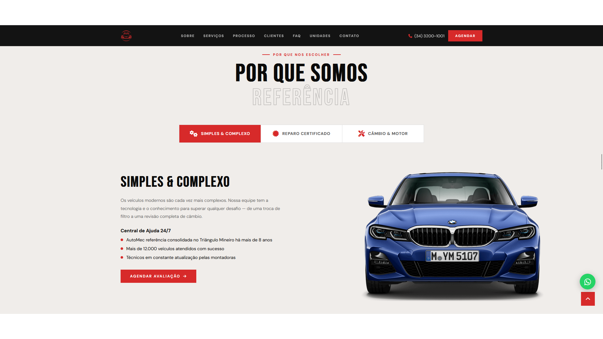
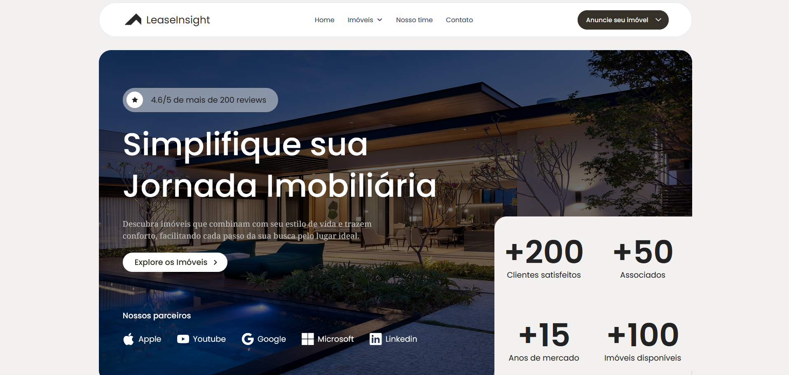
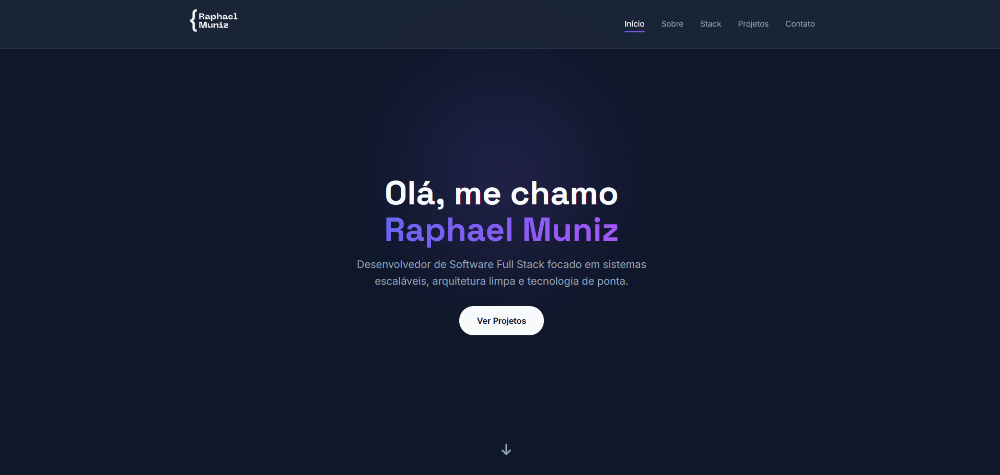
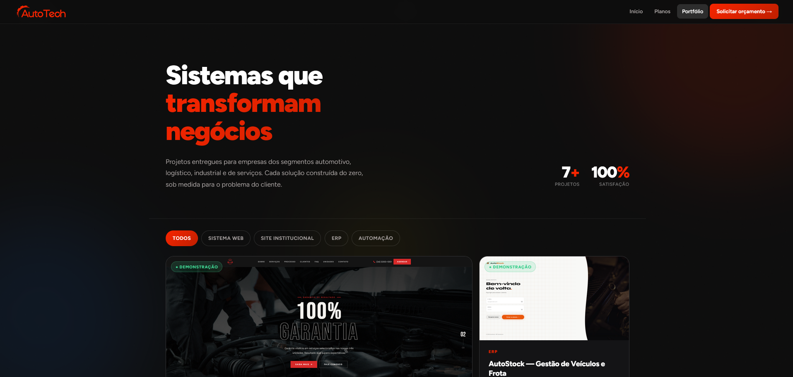

## Raphael Muniz
**Engenheiro de Software | Java · Spring Boot · Spring Security · Spring Cloud · Angular · TypeScript | REST APIs · Microservices · Docker · Kubernetes · PostgreSQL · Redis · MySQL · MongoDB · Azure · AI/LLMs**

Sou **Engenheiro de Software Full Stack** especializado em back-end Java com Spring Boot, Spring Security, Spring Data JPA e Spring Cloud — construindo APIs RESTful escaláveis e seguras. Tenho forte atuação no desenvolvimento de sistemas bem arquitetados e orientados a boas práticas de engenharia de software (SOLID, Clean Code).

- 🎓 Cursando **Sistemas de Informação na UFU** (5º período), com previsão de conclusão em dezembro de 2027.
- 🏫 Formação técnica em Informática pelo **IFSP**.
- 🚀 Autodidata por natureza — aprendo tecnologias novas com profundidade e independência.

---

  

---

## 🏢 Autotech Sistemas (Freelancer)
Atuo profissionalmente como desenvolvedor freelancer e fundador através da **Autotech Sistemas**, uma agência de desenvolvimento de software. Sob essa identidade, planejo e desenvolvo produtos comerciais robustos e soluções tecnológicas sob medida para clientes, incluindo sistemas de gestão (ERP), catálogos digitais e plataformas escaláveis.

  

---

## 💼 Experiência Prática e Projetos
Tenho experiência sólida atuando no desenvolvimento de ponta a ponta em projetos reais:

- 🛒 **Plataforma de E-commerce Full Stack:** Back-end com Spring Boot, front-end em Angular, autenticação JWT e controle de acesso baseado em perfis (Admin/Cliente).
- 🤖 **Assistente de IA Generativa:** Integração com LLMs locais via Ollama, desenvolvendo a API RESTful com Spring Boot/Spring Security e interface reativa em Angular.
- 🏥 **Iniciação Científica (UFU/HC-EBSERH):** Desenvolvimento de um sistema full stack para gestão hospitalar.

*(Experiências complementares incluem atuação com robótica representando o IFSP, ministração de aulas de programação web/robótica e vivência com integração software-hardware).*

---

## 🖥️ Alguns Dos Meus Projetos (Front-end)

<table align="center">
  <tr>
    <td align="center" width="50%">
      
       <b>E-commerce - E-Shop</b>
    </td>
    <td align="center" width="50%">
      
       <b>Assistente de IA Generativa - ChatGepeteco</b>
    </td>
  </tr>
  <tr>
    <td align="center" width="50%">
      
       <b>Site Institucional - AutoMec</b>
    </td>
    <td align="center" width="50%">
      
       <b>Sistema de Catálogo - Imobiliária LeaseInsight</b>
    </td>
  </tr>
</table>

---

## 🛠️ Stack Tecnológica

### Back-end

  
  &nbsp;&nbsp;&nbsp;
  

### Front-end

  
  &nbsp;&nbsp;&nbsp;
  

### Testes de Software

  
  &nbsp;&nbsp;&nbsp;
  

### Banco de Dados & Cache

  
  &nbsp;&nbsp;&nbsp;
  
  &nbsp;&nbsp;&nbsp;
  
  &nbsp;&nbsp;&nbsp;
  

### DevOps, Cloud & IA

  
  &nbsp;&nbsp;&nbsp;
  
  &nbsp;&nbsp;&nbsp;
  
  &nbsp;&nbsp;&nbsp;
  
  &nbsp;&nbsp;&nbsp;
  

---

## 🧠 Conhecimentos Técnicos
- Desenvolvimento e consumo de APIs RESTful
- Arquitetura em camadas e microserviços
- SOLID, Clean Code e padrões de projeto
- Versionamento com Git
- CI/CD e automação de deploy
- Scrum e práticas ágeis
- Noções de testes de software (unitários e de integração)

---

## 📫 Contato & Links

  
  
  

---

## 💻 Portfólio Pessoal

  

---

## 🏢 Portfólio Autotech Sistemas

  

